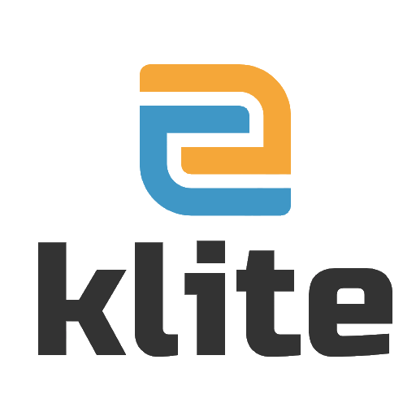

# 

[](https://jitpack.io/#keksworks/klite) [](https://github.com/keksworks/klite/actions/workflows/ci.yml)

Klite: a very light-weight (lite) non-blocking http framework for Kotlin coroutines on JVM, batteries included.
Probably the most sustainable JVM web framework (low resource usage and CO₂ emissions).

Inspired by SparkJava, Jooby, etc, but [smaller, simpler and better](docs/Comparisons.md).

Includes very light [json](json) and [jdbc & migrations](jdbc) submodules for Kotlin, which can be used independently.

Please **star the repo** to let us know you are interested.

See the [Tutorial](TUTORIAL.md) to grasp the basics quickly.

## Code sample

```kotlin
fun main() {
  Server().apply {
    assets("/", AssetsHandler(Path.of("public"), useIndexForUnknownPaths = true))
    context("/api") {
      get("/hello") { "Hello, world!" }
    }
    start()
  }
}
```

## Goals

* Minimal amount of code
  * Simple to maintain & change
  * Performance is also important, but simplicity is preferred
* Zero dependencies — Java built-in **jdk.httpserver** is used under the hood
  * Perfect for microservices
  * But still possible to easily add support for other servers if needed
  * [Sample docker image](sample/Dockerfile) is about 50–70Mb thanks to jlink, depending on used modules
  * Production applications can run with as low as 50Mb of heap memory, suitable for very cheap plans at Fly.io or Heroku
* 12-factor apps by default
* Most behaviour can be overridden if necessary
* Both route builder and annotated classes
* Very easy to do simple things, e.g.
  `@GET suspend fun route() = provider.fetchData()`
* Proper Kotlin coroutine support with working before/after filters for e.g. transactions and logging
* Shared [type-safe value classes](core/src/Types.kt) across http parameters, database columns and json fields
* Most app code will not depend on the framework, easy to switch
* Not much need for documentation — the source code is short and readable.
* Easy custom types instead of String, like Id, Phone, Email across web requests, json and DB

[llms.txt](llms.txt) version

## Dependencies

* Java 6+ built-in non-blocking jdk.httpserver
* Re-routable Java 9+ System.Logger

# Modules

* [core](core) - some reusable classes, e.g. Config. Don't depend on it directly.
* [server](server) - the main server module. See [it's documentation](server). Zero external dependencies.
* [json](json) - lightweight and easily configurable json parsing/rendering (usable *standalone*)
* [xml](xml) - fast and lightweight xml parsing into data classes (usable *standalone*)
* [csv](csv) - simple CSV parsing/generation (usable *standalone*)
* [i18n](i18n) - simple server-side translations (for emails, etc)
* [jdbc](jdbc) - provides JDBC extensions for database access, transaction handling and migrations (usable *standalone*)
* [jdbc-test](jdbc-test) - provides a way of testing your DB code using a real DB
* [jobs](jobs) - provides a simple scheduled JobRunner
* [oauth](oauth) - implements OAuth 2.0 login with several providers
* [smtp](smtp) - for sending email over SMTP
* [openapi](openapi) - generates OpenAPI 3.0 spec for all routes in a context, viewable with [Swagger UI](https://swagger.io/tools/swagger-ui/)

### Integrations

These integrate with external libraries. All of this functionality is available in Klite's own modules.

* [slf4j](slf4j) - redirects server logs to slf4j and configures it
* [jackson](jackson) - json parsing/rendering using Jackson
* [serialization](serialization) - json parsing/rendering using kotlinx-serialization
* [liquibase](liquibase) - allows to use Liquibase for DB migration

## Status

The main server module is only ~1000 lines of code.

Klite powers a number of known production apps.
Publicly announced at [KKON 2022](https://rheinwerk-kkon.de/programm/keks-klite/), see [the slides](https://docs.google.com/presentation/d/1m5UORE88nVRdZXyDEoj74c0alk1Ff_tX8mfB8oLMbk0).

## Performance

Klite (including jdk.httpserver) has sub-1ms overhead per request after warmup.
Can be verified with Apache Benchmark after [the sample project](sample) is launched:

This simple route produces ~19000 rps, with 99% taking less than 1ms:<br>
`ab -n 10000 -c 10 http://localhost:8080/api/hello`

JDBC access route produces ~11000 rps, with 99% taking less than 1ms:<br>
`ab -n 10000 -c 10 http://localhost:8080/api/hello/user/9725b054-426b-11ee-92a5-0bd2a151eea2`

Coroutine suspension test with 1000 concurrent requests, ~7000 rps, 80% of requests complete within the specified delay of 100ms:<br>
`ab -n 10000 -c 1000 http://localhost:8080/api/hello/suspend`

Tests ran on Ubuntu, Java 20, i9-9900T CPU from 2019.

## Usage

See [the sample project](sample) on how to build apps with Klite and run them in Docker.

There are open-source fully-fledged applications built with Klite (using Klite for backend):
* [StoryTracker](https://github.com/keksworks/storytracker) - an agile project management tool
* [AitaValida](https://github.com/keksworks/aitavalida) - voting compass application for Estonian elections

Klite builds are available from [jitpack](https://jitpack.io/#keksworks/klite), see also [changelog](CHANGELOG.md)

```kotlin
  repositories {
    mavenCentral()
    maven { url = uri("https://jitpack.io") }
  }

  dependencies {
    val kliteVersion = "main-SNAPSHOT" // you can put a released tag or commit hash here
    fun klite(module: String) = "com.github.keksworks.klite:klite-$module:$kliteVersion"
    implementation(klite("server"))
    // Plus any optional components with their own external dependencies, see above for list
    implementation(klite("json"))
    implementation(klite("jdbc"))
    testImplementation(klite("jdbc-test"))
    // ...
  }
```

Also configure your IDE to download dependency sources (in Intellij -> Settings -> Advanced Settings), which will serve as documentation during development.

### Using unreleased commits

Jitpack builds requested versions on the fly, so it is also good if you want to fork Klite and customize for your own needs -
you will still be able to add your fork as a Maven/Gradle dependency in your apps.

But pull-requests are welcome if you want to improve something for everybody!

### Depending on a local build

Publish to `~/.m2/repository` by running `./gradlew publishToMavenLocal`

Then add `mavenLocal()` repository to your project and use Klite version of `main-SNAPSHOT`.

### Depending on the Git repository (source) directly

If there is a problem with Jitpack, then it's possible to add the following to your `settings.gradle.kts`:

```kotlin
sourceControl {
  gitRepository(java.net.URI("https://github.com/keksworks/klite.git")) {
    producesModule("com.github.keksworks.klite:server")
    producesModule("com.github.keksworks.klite:jdbc")
    // list all subprojects you depend on in build.gradle.kts, use their un-prefixed names, e.g. server, not klite-server
  }
}
```

Gradle will clone and build Klite for you automatically during your project's build.
*Tagged version numbers* are supported this way, but *not commit hashes*.
